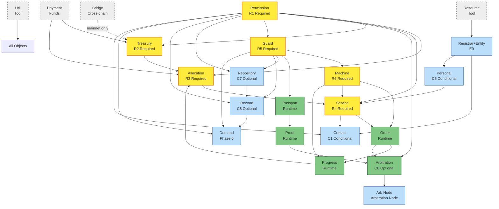

# Object Collaboration Reference

> Single authoritative reference for skills needing object collaboration, constraints, and capacity limits.
> Covers the 22-object collaboration DAG and boundary conditions.

---

## 1. 22-Object Collaboration DAG

### 1.1 Mermaid Diagram



### 1.2 ASCII Overview

```
[CORE LAYER - Merchant Build Pipeline]
  Permission(1) ──┬──► Treasury(2) ──► Allocation(3) ──┐
                  │                                      │
                  ├──► Service(4) ◄──────────────────────┘
                  │       │
                  │       ▼
                  │     Order(5) ──► Progress(6)
                  │       │              │
                  │       ▼              ▼
                  └──► Arbitration(7) ◄──┘
                            │
                            ▼
                         Arb Node(17)

[TRUST LAYER - Workflow & Evidence]
  Permission(1) ──► Guard ──┬──► Machine ──► Service(4)
                             │       │            │
                             │       ▼            ▼
                             │     Order(5)    Progress(6)
                             │
                             └──► Passport(9) ──► Proof(10) ──► Arbitration(7)

[DATA LAYER - Strategy & Incentives]
  Permission(1) ─┬──► Repository(11) ──► Reward(8) ──► Demand(12)
                 │                          ▲               │
                 └──► Reward(8) ────────────┘               │
                 └──► Demand(12) ◄──────────────────────────┘
  Guard ──► Repository(11)
  Guard ──► Reward(8)
  Guard ──► Demand(12)

[USER LAYER - Contact & Personal]
  Permission(1) ──► Contact(13) ──► Service(4).um
  Registrar+Entity(14) ──► Contact(13)
  Registrar+Entity(14) ──► Personal(18) ──► Service(4).customer_required

[TOOL LAYER - Auxiliary]
  Resource(15) ──► Registrar(14)
  Payment(16)   ──► Treasury(2) / Allocation(3)
  Util(19)      ──► All Objects
  Bridge(20)    ──► Treasury(2) (mainnet only)
```

### 1.3 Object Distribution by Layer

| Layer | Objects | Count | Role |
|-------|---------|-------|------|
| Core | Permission, Treasury, Allocation, Service, Order, Progress, Arbitration | 7 | Business pipeline |
| Trust | Guard, Machine, Passport, Proof | 4 | Workflow & evidence |
| Data | Repository, Reward, Demand | 3 | Strategy & incentives |
| User | Contact, Personal, Registrar+Entity | 3 | Contact & personal |
| Tool | Resource, Payment, Util, Bridge, Arb Node | 5 | Auxiliary |
| **Total** | | **22** | (includes Guard + Machine) |

### 1.4 Collaboration Types (5 Categories)

| Type | Meaning | Count | Example |
|------|---------|-------|---------|
| **CREATE** | A creates B (B is child of A) | 18 | Permission creates Service |
| **BIND** | A references B (B is a field of A) | 35 | Service.machine = Machine |
| **TRIGGER** | A triggers an operation on B | 12 | Order triggers Progress |
| **VALIDATE** | A validates B's state | 10 | Guard validates Service |
| **CONSUME** | A consumes B's output | 8 | Proof consumes Passport |
| **Total** | | **83** | |

### 1.5 Top 5 High-Frequency Collaboration Objects

| Rank | Object | In-degree | Out-degree | Total |
|------|--------|-----------|------------|-------|
| 1 | Permission | 13 | 0 | 13 |
| 2 | Guard | 9 | 8 | 17 |
| 3 | Service | 6 | 8 | 14 |
| 4 | Machine | 4 | 3 | 7 |
| 5 | Treasury | 4 | 2 | 6 |

Key observations:
- **Permission** is the highest in-degree object (13), the "gatekeeper" of all writes
- **Guard** is the highest out-degree object (8), the "validator"
- **Service** is the "hub" connecting merchant-side and user-side

### 1.6 Permission Reverse Reference (9 Objects with BuiltinPermissionIndex)

| Object | Index Range | Count | Usage |
|--------|------------|-------|-------|
| Repository | 100-105 | 6 | Repository operations |
| Reward | 150-157 | 8 | Reward operations |
| Machine | 200-208 | 8 | Machine operations |
| Progress | 220-225 | 6 | Progress operations |
| Treasury | 250-258 | 9 | Treasury operations |
| Service | 300-320 | 21 | Service operations |
| Arbitration | 350-368 | 19 | Arbitration operations |
| Demand | 400-408 | 9 | Demand operations |
| Contact | 450-454 | 5 | Contact operations |

Note: Permission and Order do NOT hold BuiltinPermissionIndex entries. Permission is the carrier referenced by other objects; Order references Permission indirectly through Service snapshot.

---

## 2. 5-Dimension Boundary Condition Model

```
 ┌─────────────────────────────────────────────────────────────────────┐
 │              Object Boundary Condition 5-Dimension Model             │
 └─────────────────────────────────────────────────────────────────────┘

   [1. Mutability]    [2. Prerequisites]    [3. Capacity Limits]    [4. Permissions]    [5. Irreversibility]
        │                    │                     │                     │                     │
        ▼                    ▼                     ▼                     ▼                     ▼
   Fields modifiable?    What must exist         Quantity limits?    Operation                Operations
                         before create                            permissions?             irreversible?
                         or publish?
```

| Dimension | Meaning | Values |
|-----------|---------|--------|
| 1. Mutability | Whether fields can be modified after creation | `MUTABLE` / `IMMUTABLE_AFTER_PUBLISH` / `IMMUTABLE_AFTER_CREATE` / `FROZEN` |
| 2. Prerequisites | Conditions that must be met before create/operation | Object list + stage requirements |
| 3. Capacity Limits | Quantity/size upper bounds | Numeric constants |
| 4. Permissions | Permission index required for operations | Index value or `owner_only` |
| 5. Irreversibility | Whether operations can be undone | `REVERSIBLE` / `IRREVERSIBLE` |

---

## 3. Main Boundary Condition Table (All 22 Objects)

| Object | Mutability | Prerequisites | Capacity Limits | Permissions | Irreversibility |
|--------|-----------|---------------|-----------------|-------------|-----------------|
| Permission | permission list mutable | None | MAX_PERM_FOR_ENTITY=1000, MAX_ADMIN_COUNT=500 | owner_only | Adding index reversible |
| Treasury | external_guard/owner_receive/um mutable | Permission | — | owner + 250-258 | deposit/withdraw reversible |
| Allocation | permission/sharing mutable | Treasury + Permission | MAX_SHARING_COUNT=100 | owner + allocation_guard | allocate irreversible |
| Service | machine immutable after publish | Permission | MAX_ARBITRATION_COUNT=20 | owner + 300-320 | publish irreversible |
| Order | service/machine immutable | Service(published) + Machine(published) | MAX_AGENT_COUNT=10 (actual 11), MAX_DISPUTE_COUNT=10 | owner (via Service snapshot) | create irreversible |
| Progress | machine/order immutable | Order + Machine | — | owner + 220-225 | forward irreversible |
| Arbitration | permission mutable | Order + Permission | MAX_VOTING_GUARD_COUNT=50 | owner + 350-368 | ruling irreversible |
| Reward | permission/guard mutable | Repository + Permission | — | owner + 150-157 | distribution irreversible |
| Passport | — | Guard | Time bound | gen_passport | expiry irreversible |
| Proof | — | Passport | — | submitter | submission irreversible |
| Repository | permission/guard mutable | Permission | MAX_POLICY_COUNT=50, MAX_ID_COUNT_ONCE=100 | owner + 100-105 | write reversible |
| Demand | permission/guard/service mutable | Permission | MAX_GUARD_COUNT_DEMAND=20, MAX_FEEDBACK_COUNT=20 (SDK) | owner + 400-408 | present irreversible |
| Contact | permission mutable | Permission + Registrar | — | owner + 450-454 | message irreversible |
| Registrar | — | — | MAX_RECORD_COUNT_REGISTRAR=1000 | owner | registration irreversible |
| Entity | — | Registrar | — | registrar owner | registration irreversible |
| Resource | — | — | — | owner | create reversible (delete) |
| Payment | FROZEN | — | — | — | create = freeze |
| Arb Node | can exit | Arbitration | — | owner | join reversible (exit) |
| Personal | registrar immutable | Registrar | — | owner | create reversible (delete) |
| Util | — | — | — | — | Tool module |
| Bridge | — | — | — | owner | cross-chain irreversible |
| Guard | named_operator mutable | Permission | MAX_GUARD_COUNT_PASSPORT=20 | owner | gen_passport regenerable |
| Machine | permission mutable, nodes immutable after publish | Permission | MAX_NODE_COUNT_SDK=100, MAX_FORWARD_COUNT=20, MAX_FORWARD_ORDER_COUNT=20, MAX_NODE_PAIR_COUNT=40 | owner + 200-208 | publish irreversible |

### Key Observations

1. **Payment** is the only FROZEN object (created in terminal state)
2. **Service/Machine** are the only two objects with IMMUTABLE_AFTER_PUBLISH semantics
3. **Order/Progress/Arbitration** are runtime-irreversible objects
4. **Permission** is the central node, depended on by 9 objects
5. **Guard** has 3 different MAX_GUARD_COUNT constants (Demand/Passport=20, Reward=200)

---

## 4. Capacity Limits (On-Chain Constants)

| Constant | Value | Source | Applies To | Notes |
|----------|-------|--------|-----------|-------|
| `MAX_NODE_COUNT_ONCHAIN` | 200 | machine.move | Machine | On-chain limit |
| `MAX_NODE_COUNT_SDK` | 100 | onchain-constants.ts | Machine | SDK/MCP stricter |
| `MAX_FORWARD_COUNT` | 20 | machine.move | Machine | Forwards per Pair |
| `MAX_FORWARD_ORDER_COUNT` | 20 | machine.move | Machine | Forward order count |
| `MAX_NODE_PAIR_COUNT` | 40 | machine.move | Machine | Pairs per node |
| `USER_DEFINED_PERM_INDEX_START` | 1000 | permission.move | Permission | Custom permission start |
| `MAX_PERM_FOR_ENTITY` | 1000 | permission.move | Permission | Permissions per Entity |
| `MAX_ADMIN_COUNT` | 500 | permission.move | Permission | Admin count limit |
| `MAX_AGENT_COUNT` | 10 | order.move | Order | Actual 11 (off-by-one bug) |
| `MAX_DISPUTE_COUNT` | 10 | order.move | Order | Dispute count limit |
| `MAX_SHARING_COUNT` | 100 | allocation.move | Allocation | Sharing count limit |
| `MAX_VOTING_GUARD_COUNT` | 50 | arbitration.move | Arbitration | Voting guard limit |
| `MAX_POLICY_COUNT` | 50 | repository.move | Repository | Policy count limit |
| `MAX_ID_COUNT_ONCE` | 100 | repository.move | Repository | Single ID batch limit |
| `MAX_GUARD_COUNT_DEMAND` | 20 | demand.move | Demand | Guard count for Demand |
| `MAX_GUARD_COUNT_PASSPORT` | 20 | passport.move | Passport | Guard count for Passport |
| `MAX_GUARD_COUNT_REWARD` | 200 | reward.move | Reward | Guard count for Reward |
| `MAX_RECORD_COUNT_REWARD` | 5200 | reward.move | Reward | Records per recipient |
| `MAX_RECORD_COUNT_REGISTRAR` | 1000 | registrar.move | Registrar | Registrar record count |
| `MAX_REWARD_COUNT` | 20 | demand.move | Demand | Rewards per Demand |
| `MAX_CONTEXT_REPOSITORY_COUNT` | 30 | progress.move | Progress | Context repository count |
| `MAX_ARBITRATION_COUNT` | 20 | service.move | Service | Arbitrations per Service |
| `MAX_FEEDBACK_COUNT` | 20 | demand.ts (SDK) | Demand | SDK-only, no Move check |
| `DEFAULT_SETTING_LOCK_DURATION` | 2592000000 | service.move | Service | 30 days (ms) |

### MAX_GUARD_COUNT Name Collision

| Object | Value | Constant Name |
|--------|-------|--------------|
| Demand | 20 | MAX_GUARD_COUNT_DEMAND |
| Passport | 20 | MAX_GUARD_COUNT_PASSPORT |
| Reward | 200 | MAX_GUARD_COUNT_REWARD |

---

## 5. Key Observations

### 5.1 Irreversibility Summary

| Object | Operation | Irreversibility Reason | Recovery |
|--------|-----------|----------------------|----------|
| Service | publish | On-chain state irreversible | New Service |
| Machine | publish | On-chain state irreversible | New Machine |
| Order | create | On-chain record cannot be deleted | Wait for TERMINATED |
| Payment | create | freeze_object | Unrecoverable |
| Progress | forward | Node flow irreversible | Wait for terminal |
| Arbitration | dispute/execute | Dispute/verdict irreversible | Unrecoverable |
| Allocation | allocate | Fund allocation irreversible | Unrecoverable |
| Reward | claim | Reward distribution irreversible | Unrecoverable |

### 5.2 Service Field Mutability (Critical)

| Field | CONFIGURED | PUBLISHED | ACTIVE |
|-------|------------|-----------|--------|
| permission | MUTABLE | MUTABLE | MUTABLE |
| machine | MUTABLE | **IMMUTABLE** | **IMMUTABLE** |
| order_allocators | MUTABLE | — | MUTABLE |
| arbitrations | MUTABLE | — | MUTABLE |
| buy_guard | MUTABLE | — | MUTABLE |
| price | MUTABLE | — | MUTABLE |
| publish_state | — | **SET ONCE** | — |

**Critical constraint**: `Service.machine` is the only core field that becomes immutable after publish.

### 5.3 Prerequisites Summary

| Object | Must Exist Before Create |
|--------|-------------------------|
| Treasury | Permission |
| Allocation | Treasury + Permission |
| Service | Permission |
| Machine | Permission |
| Guard | Permission |
| Order | Service (published) + Machine (published) |
| Progress | Order + Machine |
| Arbitration | Order + Permission |
| Reward | Repository + Permission |
| Passport | Guard |
| Proof | Passport |
| Repository | Permission |
| Demand | Permission |
| Contact | Permission + Registrar |
| Personal | Registrar |
| Arb Node | Arbitration |

### 5.4 Network Differences

| Aspect | testnet | mainnet |
|--------|---------|---------|
| CREATE | replaceExistName=true, repeatable | replaceExistName=false, no overwrite |
| BIND | Rebinding allowed | Locked after creation |
| TRIGGER | Repeatable | Irreversible |
| VALIDATE | Guard can be rebuilt | Guard rebuild requires updating all references |
| Bridge | ❌ Not supported | ✅ Supported |